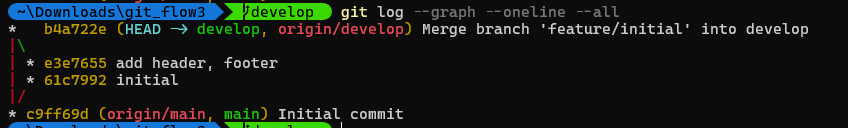

## Sistemes de control de versions

### 1. Introducció teòrica

- **Git** és un sistema de control de versions distribuit que permet als programadors guardar l’historial del codi, treballar en paralel i combinar canvis sense perdre informació.

- **Git Flow** és una estrategia de ramificació que defineix un flux de treball clar:
  - `main` → conté les versions estables i preparades per a producció.  
  - `develop` → branca base per al desenvolupament de noves funcionalitats.  
  - `feature/*` → branques temporals per afegir noves funcionalitats.  
  - `release/*` → branques per preparar versions finals.  
  - `hotfix/*` → branques per solucionar errors crítics detectats en producció.  

Aquest model facilita el treball en equip, assegura un desenvolupament organitzat i millora la qualitat del codi.

---

### 2. Procés realitzat

#### 👤 Usuari 1 (repositori i estructura inicial)
1. Crea el repositori a GitHub i inicialitza **Git Flow**.  
2. Genera les branques principals: `main` i `develop`.  
3. Implementa l’estructura inicial del projecte amb el [boilerplate](link).  
   - La pàgina inicial conté: capçalera, barra de navegació (`Home`) i peu de pàgina (`footer`).  

#### 👤 Usuari 2 (contingut HTML)
1. Crea dues funcionalitats mitjançant branques **feature**:  
   - `feature/contingutHTML`  
   - `feature/atributsHTML`  
2. Desenvolupa les seccions corresponents i les integra a `develop`.

#### 👤 Usuari 3 (estils CSS i release)
1. Crea la branca `feature/estilsCSS` i afegeix els estils al projecte.  
2. Integra totes les funcionalitats a `develop`.  
3. Obri una branca de **release**:
   - `release/v1.0`  
   - Publica la versió **v1.0** amb totes les característiques integrades.

Creació feature/estilsCSS

Creació release v1.0

#### 👤 Usuari 1 (proves i hotfix)
1. Durant les proves, detecta una millora en la secció de contingut d’usuari 2.  
2. Crea una branca de **hotfix**:  
   - `hotfix/milloresV_1_0`  
3. Aplica les millores i actualitza la versió estable.

